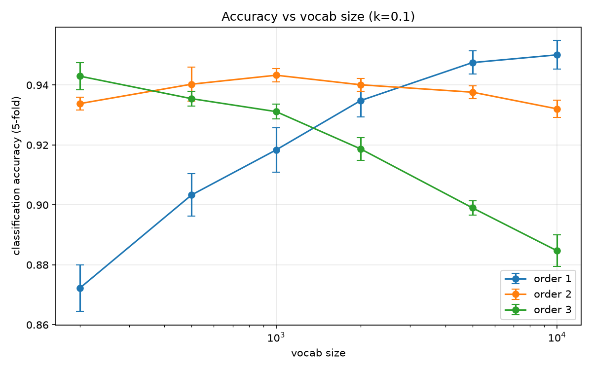
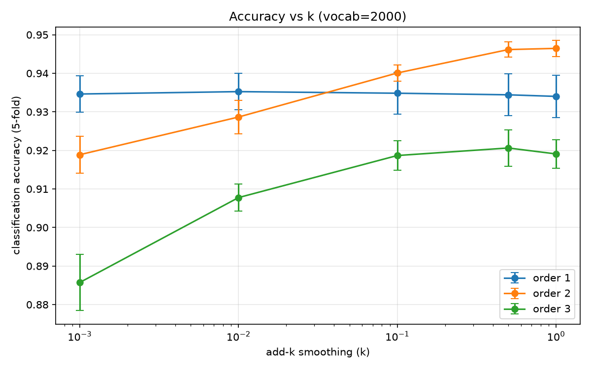
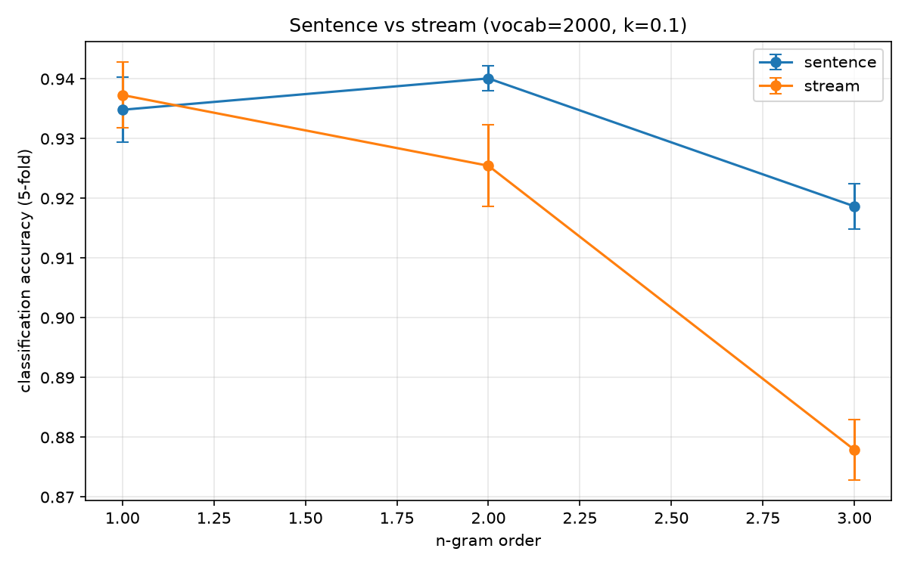

# N-gram Language Models and Author Identification

BPE tokenizer, n-gram language models with add-k smoothing, a perplexity
measure, and an author identifier that tells Tolkien (The Hobbit) from
Conan Doyle (The Lost World).

## Setup

    python3 -m venv .venv
    source .venv/bin/activate
    pip install tokenizers matplotlib

Put the training books in `data/` as `hobbit.txt` and `lostworld.txt`
(Gutenberg header/footer stripped). For the extra generalization check, also
put `sherlockholmes.txt` and `fellowship.txt` in `data/`.

## Files

- `tokenizer.py` — BPE tokenizer wrapping HuggingFace.
- `ngram_language_model.py` — n-gram model of any order with add-k smoothing.
- `author_identification.py` — sentence splitting and the per-author classifier.
- `main.py` — trains the final model.
- `sweep.py` — the hyperparameter sweeps and plots.
- `external_test.py` — extra out-of-corpus check (not required by the assignment).

## How to run

    python main.py        # train the final model
    python sweep.py       # regenerate the plots in plots/
    python external_test.py

## Final configuration

Character-level trigram: order 3, vocab ~200, k = 1, byte-level
pre-tokenization, sentence segmentation, equal-length training.

## Results

All accuracies are 5-fold cross-validation, mean +/- std.

### Vocab size vs order 

| Vocab  | Unigram | Bigram | Trigram |
|--------|---------|--------|---------|
| 200    | 0.872   | 0.934  | 0.943   |
| 500    | 0.903   | 0.940  | 0.935   |
| 1000   | 0.918   | 0.943  | 0.931   |
| 2000   | 0.935   | 0.940  | 0.919   |
| 5000   | 0.947   | 0.938  | 0.899   |
| 10000  | 0.950   | 0.932  | 0.885   |

Higher orders win at small vocab, unigram wins at large vocab (it separates by
vocabulary/topic, not style).

### Smoothing k vs order, vocab 2000

| k      | Unigram | Bigram | Trigram |
|--------|---------|--------|---------|
| 1.0    | 0.934   | 0.946  | 0.919   |
| 0.5    | 0.934   | 0.946  | 0.921   |
| 0.1    | 0.935   | 0.940  | 0.919   |
| 0.01   | 0.935   | 0.929  | 0.908   |
| 0.001  | 0.935   | 0.919  | 0.886   |

Larger k helps, most for higher orders. Unigram is flat.

### Sentence vs stream, vocab 2000 (see plots/sweep_segmentation.png)

| Order   | Sentence | Stream |
|---------|----------|--------|
| Unigram | 0.935    | 0.937  |
| Bigram  | 0.940    | 0.925  |
| Trigram | 0.919    | 0.878  |

Sentence segmentation is as good or better everywhere.

### Out-of-corpus check (balanced accuracy on new books, equal-length, k = 1)

| Model                        | Balanced accuracy |
|------------------------------|-------------------|
| Unigram, vocab 10000         | 0.47              |
| Word bigram, vocab 2000      | 0.56              |
| Character trigram, vocab 200 | 0.66              |

Accuracy also rises with passage length: for the character trigram, grouping
10 sentences per passage instead of 4 raised balanced accuracy from 0.66 to 0.72.

## Use of AI

I wrote the tokenizer, n-gram model, author identification, and main files
myself, using Claude for guidance on the concepts. I used Claude to help write
sweep.py and external_test.py. Only generic libraries were used (tokenizers,
collections, math, re, random, statistics, matplotlib); no ready-made n-gram
implementation.